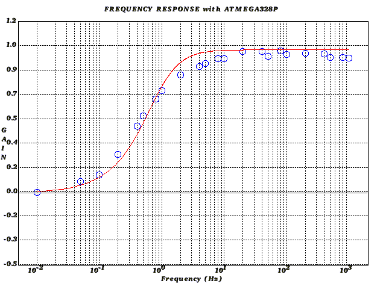
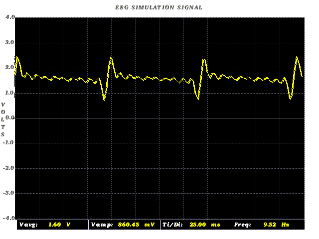

## Table of Contents

* [Background](#background)
* [Installation](#installation)
* [Usage](#usage) 
* [Examples](#examples)

## Background
	The purpose of this project was to repackage some legacy software that had been written	for the
	Borland	Turbo C graphics library running on Windows systems. Graphics cpability was required for
	running simple graphics routines on the Raspberry Pi Linux platform. The graphics package had
	originally been	written in C++. However, for the purposes of this project, the coding has reverted
	back to C. Although rather basic,the Linux Graphics library provides all the necessary functionality
	required to generate scientific static plots and animated plot routines (for instance, displaying
	a real time electronic signal from an external electronic peripheral). The graphic_lx.c library is
	an abstraction of the Graphics.c library for generating scientific plots.
	
## Installation
   A good guide to installing the Linux Graphics Library may be found here:
   https://www.codingalpha.com/install-run-graphics-h-ubuntu/ 		
	
## Usage
   The graphic_lx.c library contains a mix of functions for setting up graphs with features such
   as title, axis scales and labelling, and plot grid. Various plot types can be realised: 
   line plot, pixel plot, circle or rectangle plots. A legend can be set up to accompany the
   main graph. Axis scales can be linear or logarithmic. 
   Graphic animations of varying signals in real time also be generated. A suitable graphic
   presentation can be developed by utilisng suitable functions within the library.   
	
## Examples
### Frequency Response curve   
   The following two graphs illustrate a frequency response curve for a high pass filter (HPF) sub-circuit
   on a breadboard connected to an Arduino Uno. Square waves of various frequencies are generated on one of the
   Arduino digital output pins and passed through the HPF.The Arduino MCU sends sampled data via UART to a Linux PC. 
   Frequencies are plotted logarithmically, and a graph plotted automatically on receipt of data through
   the PC serial port. The actual measured data is plotted with circles, and the theoretical curve
   (for the R/C HPF combination) plotted as a line. Graph 1 uses a black background, and Graph 2 uses a white background.
   
#### Graph 1
   	

#### Graph 2

### Simple Oscilloscope Trace  
   Graph 3 illustrates the display of an arbitrary signal of frequency 10Hz generated by a Digilent Analog Discovery 2, passing
   through a high pass filter, an MCP3008 Analog to Digital Converter and then sent to a Raspberry Pi via the SPI communications
   protocol. The graphing software, running on the Raspberry Pi and receiving data in realtime, is implemented as a simple oscilloscope trace.
   The graph shows a calculated frequency of 9.52Hz for the main signal component. This is to be compared with Graph 4 which
   shows the the analog signal traced by a Rigol oscilloscope before the signal is passed to the MCP3008 ADC. As can be seen,
   the graphics software reproduces the analog signal well. 
      
#### Graph 3

#### Graph 4

